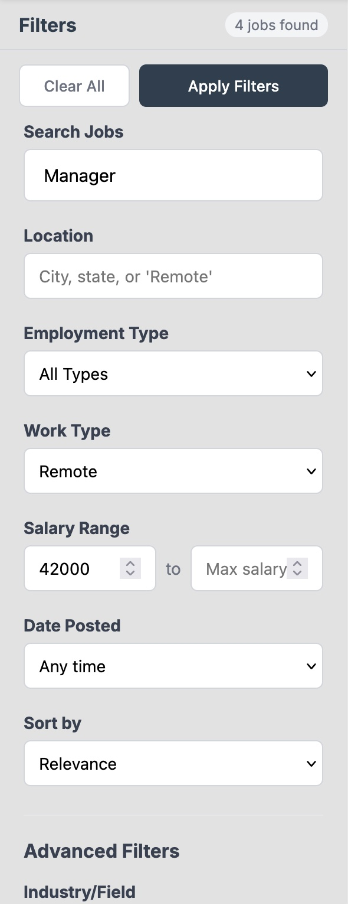

# JobJunction

A modern, full-featured job board application built with React and Vite. JobJunction helps users discover, search, and save job opportunities with an intuitive interface and plenty of filters.


## Features

### Job Search & Discovery

- **Advanced Search Filters**: Search jobs by keyword, location, salary range, employment type, and more
- **Smart Filtering**: Filter by remote work options, experience level, field, and posting date
- **Sorting Options**: Sort results by relevance, date, or salary
- **Pagination**: Easily navigate through large result sets



### User Account Management

- **Authentication**: Secure signup and login functionality
- **Email Verification**: Verify your email address for enhanced security
- **Persistent Sessions**: Stay logged in across browser sessions

### Save & Organize Jobs

- **Save Favorites**: Bookmark interesting job listings for later review
- **Saved Jobs Page**: Dedicated page to view and manage all your saved opportunities
- **Quick Actions**: Easily save or remove jobs with a single click


## Tech Stack

- **Frontend**: React 19 with React Router
- **Build Tool**: Vite
- **Styling**: Custom CSS with responsive design

## Prerequisites

Before running this application, make sure you have:

- Node.js (v16 or higher)
- npm or yarn package manager
- Backend API server running (separate repository)

## Getting Started

### Installation

1. Clone the repository:

   ```bash
   git clone <your-repository-url>
   cd job-board
   ```

2. Install dependencies:

   ```bash
   npm install
   ```

3. Create a `.env` file in the root directory with your API endpoints:

   ```env
   VITE_API_AUTH_URL=<your-auth-api-url>
   VITE_API_USERS_URL=<your-users-api-url>
   VITE_API_JOBS_URL=<your-jobs-api-url>
   ```

4. Start the development server:

   ```bash
   npm run dev
   ```

5. Open your browser and navigate to `http://localhost:5173`

## Run Locally

- `npm run dev` - Start development server

## Project Structure

```
job-board/
├── src/
│   ├── components/        # Reusable UI components
│   │   ├── Filters/       # Filter components
│   │   ├── JobList/       # Job listing components
│   │   ├── LoginSignup/   # Authentication components
│   │   └── shared/        # Shared components (Loading, Error, Empty states)
│   ├── contexts/          # React context providers
│   ├── hooks/             # Custom React hooks
│   ├── pages/             # Page components
│   ├── services/          # API service functions
│   ├── css/               # Component styles
│   └── App.jsx            # Main application component
└── package.json           # Project dependencies
```

## Key Features Explained

### Filter Persistence

Search filters are saved to localStorage, so your preferences persist across sessions.

### Token Management

The app automatically refreshes authentication tokens when they expire, ensuring uninterrupted access to protected features.

## Environment Variables

Required environment variables:

| Variable             | Description                             |
| -------------------- | --------------------------------------- |
| `VITE_API_AUTH_URL`  | Base URL for authentication API         |
| `VITE_API_USERS_URL` | Base URL for user-related API endpoints |
| `VITE_API_JOBS_URL`  | Base URL for jobs API endpoints         |

## Acknowledgments

- Job data provided by JSearch API

---
